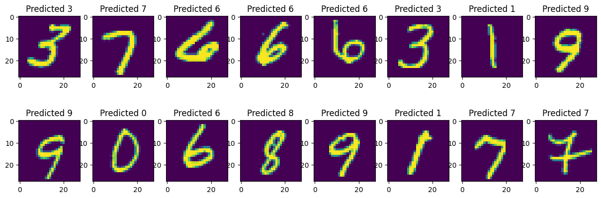

# NNfromScratch
 Neural network from scratch

Watching some videos of Andrej Karpathy I understood the importance of the backward pass in neural networks.  
For this reason i implemented some common neural networks modules totally in numpy to train my self.  

You can find them in the 'neural_net' folder.  
Among them are:
* a tensor class which stores values of matrices and their corresponding gradients
* all modules (linear layer, relu ...) allows for forward, backward pass plus a function that allows to update the weights in a SGD fashion
* a ANN class which allows to train its modules by performing the backward pass over all of them

I made a test with the mnist data set and a simple neural network to test the correctness of my implementation.  

 